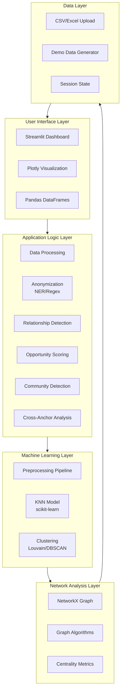
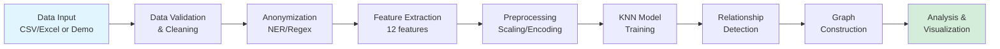
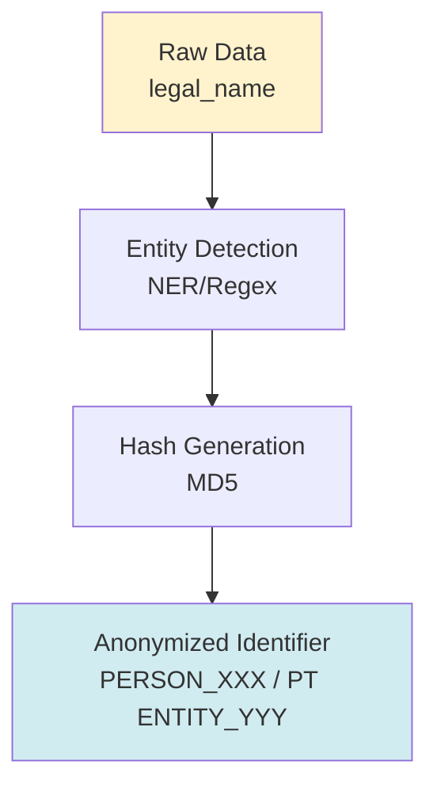
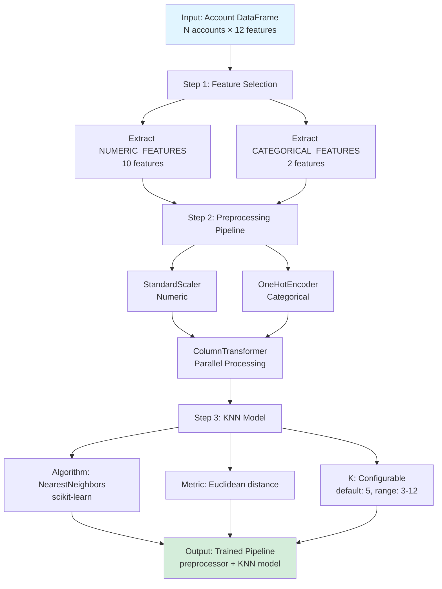
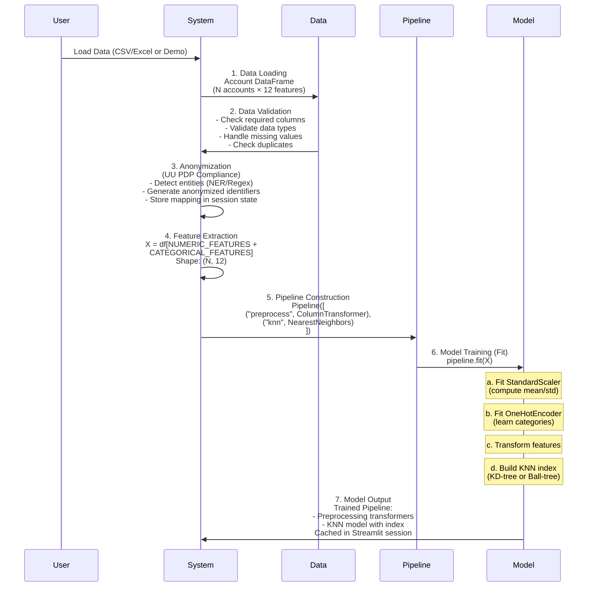

# System Architecture Documentation

## Table of Contents

1. [High-Level Architecture](#high-level-architecture)
2. [Data Architecture](#data-architecture)
3. [Model Architecture](#model-architecture)
4. [Training Flow](#training-flow)
5. [Inference Flow](#inference-flow)
6. [Component Details](#component-details)

---

## High-Level Architecture

### System Overview

The OBS Account Relationship Dashboard is a **Streamlit-based web application** that uses **K-Nearest Neighbors (KNN)** machine learning algorithm to identify behavioral relationships between banking accounts in the poultry supply chain ecosystem.

### Architecture Diagram



### System Components

#### 1. **User Interface Layer**
- **Streamlit Framework**: Web-based dashboard interface
- **Plotly**: Interactive visualizations (network graphs, charts)
- **Pandas**: Data manipulation and display

#### 2. **Application Logic Layer**
- **Data Processing**: Data validation, cleaning, transformation
- **Anonymization**: NER-based or regex-based PII anonymization
- **Relationship Detection**: KNN-based similarity analysis
- **Opportunity Scoring**: Composite scoring algorithm
- **Community Detection**: Clustering algorithms
- **Cross-Anchor Analysis**: Cross-ecosystem relationship analysis

#### 3. **Machine Learning Layer**
- **Preprocessing Pipeline**: Feature scaling and encoding
- **KNN Model**: Nearest neighbor search (scikit-learn)
- **Clustering Models**: Louvain (graph-based) and DBSCAN (density-based)

#### 4. **Network Analysis Layer**
- **NetworkX**: Graph construction and analysis
- **Centrality Metrics**: Degree, betweenness centrality
- **Graph Algorithms**: Community detection, path analysis

#### 5. **Data Layer**
- **CSV/Excel Upload**: User-provided data ingestion
- **Demo Data Generator**: Synthetic poultry ecosystem data
- **Session State**: Streamlit session management

### Technology Stack

| Layer | Technology | Purpose |
|-------|-----------|---------|
| **Frontend** | Streamlit | Web dashboard framework |
| **Visualization** | Plotly | Interactive charts and graphs |
| **Data Processing** | Pandas, NumPy | Data manipulation |
| **ML Framework** | scikit-learn | KNN, preprocessing, clustering |
| **Network Analysis** | NetworkX | Graph algorithms |
| **NER** | spaCy (optional) | Named entity recognition |
| **Language** | Python 3.11+ | Core programming language |

---

## Data Architecture

### Data Flow



### Data Schema

#### Account Data Schema

| Field | Type | Description | Required |
|-------|------|-------------|----------|
| `account_id` | String | Unique account identifier | ✅ Yes |
| `legal_name` | String | Company/business name (anonymized) | Optional |
| `ecosystem_role` | String | Role in supply chain | Optional |
| `anchor_group` | String | Anchor group affiliation | Optional |
| `anchor_level` | Integer | Distance from anchor (0-2) | Optional |
| `segment_code` | String | Corporate/SME/Micro | ✅ Yes |
| `primary_bank` | String | Current primary bank | Optional |
| `bri_status` | String | Existing/NTB | Optional |
| `ntb_status` | String | NTB status | Optional |
| `avg_txn_amount_30d` | Float | Avg transaction (30d) | ✅ Yes |
| `txn_count_30d` | Integer | Transaction count (30d) | ✅ Yes |
| `turnover_90d` | Float | Total turnover (90d) | ✅ Yes |
| `cash_withdrawal_ratio_90d` | Float | Cash withdrawal ratio | ✅ Yes |
| `merchant_diversity_90d` | Integer | Unique merchants | ✅ Yes |
| `unique_devices_90d` | Integer | Device diversity | ✅ Yes |
| `unique_ips_90d` | Integer | IP diversity | ✅ Yes |
| `country_risk_score` | Float | Geographic risk | ✅ Yes |
| `channel_mix_online_ratio` | Float | Online channel ratio | ✅ Yes |
| `lead_score_bri` | Integer | BRI lead score (0-100) | ✅ Yes |

#### Relationship Edge Schema

| Field | Type | Description |
|-------|------|-------------|
| `src` | String | Source account ID |
| `dst` | String | Destination account ID |
| `distance` | Float | Euclidean distance |
| `similarity` | Float | Similarity score (0-1) |
| `src_anchor` | String | Source anchor group |
| `dst_anchor` | String | Destination anchor group |
| `is_cross_anchor` | Boolean | Cross-anchor relationship |
| `is_anchor_bridge` | Boolean | Involves anchor-level account |
| `anchor_distance` | Integer | Anchor level difference |

### Feature Engineering

#### Numeric Features (10 features)

```python
NUMERIC_FEATURES = [
    "avg_txn_amount_30d",      # Transaction behavior
    "txn_count_30d",            # Activity level
    "turnover_90d",             # Business volume
    "cash_withdrawal_ratio_90d", # Cash usage pattern
    "merchant_diversity_90d",   # Business diversity
    "unique_devices_90d",       # Device fingerprint
    "unique_ips_90d",           # IP diversity
    "country_risk_score",       # Geographic risk
    "channel_mix_online_ratio", # Digital adoption
    "lead_score_bri"            # Pre-calculated lead score
]
```

**Preprocessing**: StandardScaler (normalization to 0-1 range)

#### Categorical Features (2 features)

```python
CATEGORICAL_FEATURES = [
    "segment_code",      # Corporate/SME/Micro
    "ecosystem_role"     # Supply chain role
]
```

**Preprocessing**: OneHotEncoder (binary encoding)

### Data Storage

#### In-Memory Storage
- **Pandas DataFrames**: Account data, relationships, opportunities
- **NetworkX Graphs**: Network structure
- **Session State**: Streamlit session management

#### Data Persistence
- **CSV Export**: Accounts, relationships, opportunities
- **Session Cache**: Streamlit `@st.cache_data` for data
- **Model Cache**: Streamlit `@st.cache_resource` for models

### Data Anonymization

#### Anonymization Pipeline



**Anonymization Map**: Stored in `st.session_state.anonymization_map` for consistency

---

## Model Architecture

### KNN Model Pipeline



### Model Components

#### 1. Preprocessing Pipeline

```python
Pipeline([
    ("preprocess", ColumnTransformer([
        ("num", StandardScaler(), NUMERIC_FEATURES),
        ("cat", OneHotEncoder(handle_unknown="ignore"), CATEGORICAL_FEATURES)
    ])),
    ("knn", NearestNeighbors(n_neighbors=K, metric="euclidean"))
])
```

**StandardScaler**:
- Normalizes numeric features to mean=0, std=1
- Formula: `(x - mean) / std`
- Ensures all features contribute equally

**OneHotEncoder**:
- Converts categorical features to binary vectors
- Example: `segment_code` → [1,0,0] for Corporate, [0,1,0] for SME, etc.
- Handles unknown categories gracefully

#### 2. KNN Model

**Algorithm**: K-Nearest Neighbors (unsupervised learning)

**Parameters**:
- `n_neighbors`: Number of neighbors (K) - default: 5
- `metric`: Distance metric - "euclidean"
- `algorithm`: "auto" (auto-selects best algorithm)

**Distance Calculation**:
```
Euclidean Distance = √(Σ(xi - yi)²)
```

**Similarity Conversion**:
```
Similarity = exp(-distance)
```

### Clustering Models

#### 1. Louvain Algorithm (Graph-Based)

**Purpose**: Community detection in network graph

**Algorithm**:
- Modularity optimization
- Hierarchical clustering
- Graph-based (requires network structure)

**Input**: NetworkX Graph
**Output**: Community assignments (dictionary: account_id → community_id)

#### 2. DBSCAN Algorithm (Density-Based)

**Purpose**: Density-based clustering on feature space

**Parameters**:
- `eps`: Maximum distance for neighborhood (default: 0.6)
- `min_samples`: Minimum points in neighborhood (default: 3)

**Algorithm**:
- Density-based clustering
- Feature-space based (uses preprocessed features)
- Can identify outliers (noise points: -1)

**Input**: Preprocessed feature matrix
**Output**: Cluster labels (array: cluster_id per account)

### Opportunity Scoring Model

**Type**: Rule-based composite scoring (not ML model)

**Components**:
1. **Network Score** = Degree Centrality × 20
2. **Influence Score** = Betweenness Centrality × 15
3. **Ecosystem Score** = min(Community Size / 8, 1) × 15
4. **Lead Score** = (lead_score_bri / 100) × 25
5. **Potential Score** = NTB Bonus (15) + Anchor Proximity (10)

**Total Score** = Sum of all components (capped at 100)

---

## Training Flow

### KNN Model Training



### Training Pseudocode

```python
def build_knn_pipeline(df, n_neighbors=6):
    # Step 1: Create transformers
    numeric_transformer = StandardScaler()
    categorical_transformer = OneHotEncoder(handle_unknown="ignore")
    
    # Step 2: Identify categorical features
    cat_features = [f for f in CATEGORICAL_FEATURES if f in df.columns]
    
    # Step 3: Build preprocessing pipeline
    preprocessor = ColumnTransformer(
        transformers=[
            ("num", numeric_transformer, NUMERIC_FEATURES),
            ("cat", categorical_transformer, cat_features),
        ]
    )
    
    # Step 4: Create KNN model
    knn = NearestNeighbors(
        n_neighbors=min(n_neighbors, len(df)),
        metric="euclidean"
    )
    
    # Step 5: Combine into pipeline
    pipeline = Pipeline(steps=[
        ("preprocess", preprocessor),
        ("knn", knn)
    ])
    
    # Step 6: Extract features and fit
    X = df[NUMERIC_FEATURES + cat_features]
    pipeline.fit(X)
    
    return pipeline, cat_features
```

### Training Characteristics

**Training Type**: Unsupervised Learning
- No labeled data required
- Learns from account feature patterns
- No ground truth relationships needed

**Training Time**: O(N log N) where N = number of accounts
- Fast for small-medium datasets (<10,000 accounts)
- Scales well with scikit-learn optimizations

**Model Persistence**: 
- Cached in Streamlit session using `@st.cache_resource`
- Re-trained when data or parameters change
- No disk persistence (in-memory only)

---

## Inference Flow

### Relationship Detection Inference

```mermaid
flowchart TD
    A[1. Input: Trained Pipeline +<br/>Account DataFrame<br/>Parameters: K, max_distance] --> B[2. Feature Extraction<br/>X = df[NUMERIC_FEATURES +<br/>CATEGORICAL_FEATURES]<br/>Shape: N, 12]
    
    B --> C[3. Preprocessing Transform<br/>X_processed = transform X]
    C --> C1[a. StandardScaler.transform<br/>normalize numeric]
    C --> C2[b. OneHotEncoder.transform<br/>encode categorical]
    C --> C3[c. Concatenate features<br/>Output: N, M where M > 12]
    
    C1 --> D[4. KNN Query<br/>Find Neighbors]
    C2 --> D
    C3 --> D
    
    D --> D1[distances, indices =<br/>kneighbors X_processed<br/>Output: N, K arrays]
    
    D1 --> E[5. Edge Creation<br/>For each account i:<br/>For each neighbor j:<br/>if distance <= max_distance:<br/>similarity = exp -distance<br/>Create edge]
    
    E --> F[6. Cross-Anchor Analysis<br/>Check anchor groups<br/>Calculate cross-anchor flags<br/>Add anchor metadata]
    
    F --> G[7. Graph Construction<br/>G = nx.Graph<br/>add_nodes_from account_ids<br/>add_edges_from edges]
    
    G --> H[8. Community Detection]
    H --> H1[Option A: Louvain<br/>louvain_communities G]
    H --> H2[Option B: DBSCAN<br/>fit_predict X_processed]
    
    H1 --> I[9. Opportunity Scoring<br/>For each account:<br/>Calculate all scores<br/>Total = sum scores<br/>Priority = classify]
    H2 --> I
    
    I --> J[10. Output: Results<br/>- Relationship edges DataFrame<br/>- NetworkX Graph<br/>- Community assignments<br/>- Opportunity scores<br/>- Cross-anchor metrics]
    
    style A fill:#e1f5ff
    style J fill:#d4edda
```

### Inference Pseudocode

```python
def find_neighbors_and_edges(df, pipeline, cat_features, max_distance=2.0):
    # Step 1: Extract features
    X = df[NUMERIC_FEATURES + cat_features]
    
    # Step 2: Preprocess (transform)
    X_processed = pipeline.named_steps["preprocess"].transform(X)
    
    # Step 3: Find neighbors (KNN query)
    distances, indices = pipeline.named_steps["knn"].kneighbors(X_processed)
    
    # Step 4: Create edges
    edges = []
    account_ids = df["account_id"].values
    
    for i, (d_row, idx_row) in enumerate(zip(distances, indices)):
        src_acc = account_ids[i]
        
        # Skip first neighbor (self)
        for dist, j in zip(d_row[1:], idx_row[1:]):
            dst_acc = account_ids[j]
            
            # Filter by distance threshold
            if dist <= max_distance:
                similarity = float(np.exp(-dist))
                
                # Create edge
                edges.append({
                    "src": src_acc,
                    "dst": dst_acc,
                    "distance": float(dist),
                    "similarity": similarity,
                    # ... additional metadata
                })
    
    return pd.DataFrame(edges)
```

### Inference Performance

**Time Complexity**: O(N × K × log N)
- N = number of accounts
- K = number of neighbors
- log N = tree search complexity

**Space Complexity**: O(N × M)
- N = number of accounts
- M = number of features (after encoding)

**Optimization**:
- KD-tree or Ball-tree for fast neighbor search
- Caching of preprocessed features
- Batch processing for large datasets

---

## Component Details

### Key Functions

#### 1. `build_knn_pipeline(df, n_neighbors=6)`
- **Purpose**: Construct and train KNN pipeline
- **Input**: DataFrame, number of neighbors
- **Output**: Trained pipeline, categorical features list
- **Complexity**: O(N log N)

#### 2. `find_neighbors_and_edges(df, pipeline, cat_features, max_distance=2.0)`
- **Purpose**: Find similar accounts and create relationship edges
- **Input**: DataFrame, trained pipeline, max distance threshold
- **Output**: DataFrame with relationship edges
- **Complexity**: O(N × K)

#### 3. `build_graph(df, edges_df)`
- **Purpose**: Construct NetworkX graph from edges
- **Input**: DataFrame, edges DataFrame
- **Output**: NetworkX Graph object
- **Complexity**: O(E) where E = number of edges

#### 4. `calculate_opportunity_score(G, df, community_map)`
- **Purpose**: Calculate opportunity scores for all accounts
- **Input**: Graph, DataFrame, community assignments
- **Output**: Dictionary of scores per account
- **Complexity**: O(N + E)

#### 5. `detect_communities_louvain(G)`
- **Purpose**: Community detection using Louvain algorithm
- **Input**: NetworkX Graph
- **Output**: Community assignments dictionary
- **Complexity**: O(N log N)

#### 6. `detect_communities_dbscan(df, cat_features, eps, min_samples)`
- **Purpose**: Density-based clustering
- **Input**: DataFrame, parameters
- **Output**: Community assignments dictionary
- **Complexity**: O(N log N)

### Caching Strategy

**Streamlit Caching**:
- `@st.cache_data`: For data (DataFrames, arrays)
- `@st.cache_resource`: For models (pipelines, NER models)

**Cache Invalidation**:
- Data changes → cache invalidated
- Parameter changes → cache invalidated
- Manual refresh → cache cleared

### Error Handling

**Data Validation**:
- Missing required columns → Error message
- Invalid data types → Type conversion or error
- Duplicate account IDs → Error message
- Insufficient data (<3 accounts) → Error message

**Model Errors**:
- Empty dataset → Return empty results
- No neighbors found → Return empty edges
- Model training failure → Fallback to defaults

---

## References

### Code References
- Main Application: `app.py`
- KNN Pipeline: `build_knn_pipeline()` function
- Relationship Detection: `find_neighbors_and_edges()` function
- Graph Construction: `build_graph()` function
- Opportunity Scoring: `calculate_opportunity_score()` function

### Related Documentation
- **[Ecosystem Relationship Identification Guide](ECOSYSTEM_RELATIONSHIP_IDENTIFICATION.md)**: How relationships are identified
- **[Lead & Opportunity Identification Guide](LEAD_OPPORTUNITY_IDENTIFICATION.md)**: Opportunity scoring details
- **[Cross-Anchor Relationships Guide](CROSS_ANCHOR_RELATIONSHIPS.md)**: Cross-anchor analysis
- **[Data Privacy & Anonymization Guide](DATA_PRIVACY_ANONYMIZATION.md)**: Anonymization architecture

### External Resources
- [scikit-learn NearestNeighbors](https://scikit-learn.org/stable/modules/neighbors.html)
- [NetworkX Documentation](https://networkx.org/)
- [Streamlit Caching](https://docs.streamlit.io/library/advanced-features/caching)

---

**Last Updated**: 2025-01-08  
**Version**: 1.0  
**Author**: KNN Dashboard Development Team

